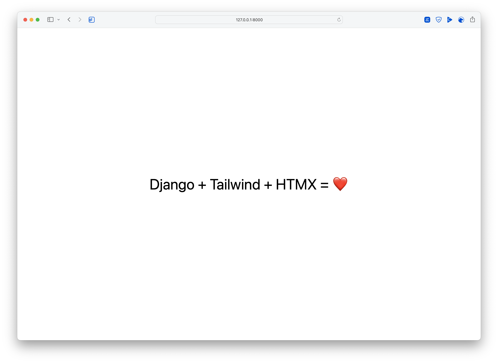

# django-startproject



> Django startproject template with batteries and nice tooling.

I took the inspiration from Jeff Triplett's [django-startproject](https://github.com/jefftriplett/django-startproject) and created my own starter for a fresh django project. It includes the batteries I use regularly. 🤷‍♂️

The template is also inspired by Carlton Gibson's Post [The Single Folder Django Project Layout](https://noumenal.es/notes/django/single-folder-layout/). It uses the single folder layout as a start as I always run in the same situation Carlton describes in his post. If you have to split the project into several apps, you can always call `python manage.py startapp` later on.

Out of the box SQLite is configured, but you can easily activate MySQL or Postgres support.

## Features

- Python 3.12
- Django 5.1.x
- django-htmx
- django-tailwind-cli
- django-typer
- django-allauth
- environs\[django\]
- heroicons
- whitenoise
- [Optimzed SQLite settings](https://gcollazo.com/optimal-sqlite-settings-for-django/)
- [Argon2 password hashing](https://docs.djangoproject.com/en/4.1/topics/auth/passwords/)
- uses the [single folder Django project layout](https://noumenal.es/notes/django/single-folder-layout/)
- [adds some standard templatetags to the builtins](https://adamj.eu/tech/2023/09/15/django-move-template-tag-library-builtins/)
- A local install of htmx.
- BaseCommand class for writing management commands that log to a rotating logfile and the console if run in an interactive shell. See `project_name/management/commands/base.py`.

### Development tools

- django-types
- django-browser-reload
- django-test-plus
- model-bakery
- pre-commit setup inspired by [Boost your Django DX](https://adamchainz.gumroad.com/l/byddx)
- sane ruff configuration
- [proper setup for Django unit test discovery](https://code.visualstudio.com/docs/python/testing#_django-unit-tests)
- [uv](https://docs.astral.sh/uv/) for dependency management
- [just](https://github.com/casey/just) for project management and maintenance

## Install

```shell
$ django-admin startproject \
      --extension=py,toml \
      --exclude=.hidden \
      --template=https://github.com/oliverandrich/django-startproject/archive/main.zip \
      example_project

# Setup environment and install dependencies
$ just bootstrap

# Migrate database
$ just migrate

# Start dev server
$ just runserver
```

## Usage

```shell
# Bootstrap the project and install dependencies
just bootstrap

# Upgrade/install all dependencies defined in pyproject.toml
just upgrade

# Run database migrations
just migrate

# Create database migrations
just makemigrations

# Start debugserver
just runserver
# or
just debugserver

# Start the interactive django shell
just shell

# Start manage.py for all cases not covered by other commands
just manage ...

# Run pre-commit rules on all files
just lint

# Run test suite
just test

# run test suite with code coverage analysis
just coverage 
```

## Environemt Variables for Docker and your .env file

Or when run as a [12-Factor application](https://12factor.net).

| Environment Variable         | Default                               | Location         |
| ---------------------------- | ------------------------------------- | ---------------- |
| ALLOWED_HOSTS                | []                                    | settings.py      |
| CACHE_URL                    | "locmem://"                           | settings.py      |
| CSRF_TRUSTED_ORIGINS         | []                                    | settings.py      |
| DATABASE_URL                 | "sqlite:///db.sqlite3"                | settings.py      |
| DEBUG                        | False                                 | settings.py      |
| EMAIL_URL                    | "console:"                            | settings.py      |
| GUNICORN_BIND                | "0.0.0.0:8000"                        | gunicorn.conf.py |
| GUNICORN_MAX_REQUESTS        | 1000                                  | gunicorn.conf.py |
| GUNICORN_MAX_REQUESTS_JITTER | 50                                    | gunicorn.conf.py |
| GUNICORN_WORKERS             | `multiprocessing.cpu_count() * 2 + 1` | gunicorn.conf.py |
| INTERNAL_IPS                 | []                                    | settings.py      |
| LANGUAGE_CODE                | "EN"                                  | settings.py      |
| SECRET_KEY                   | `get_random_secret_key()`             | settings.py      |
| TAILWIND_CLI_PATH            | "~/.local/bin"                        | settings.py      |
| TIME_ZONE                    | "UTC"                                 | settings.py      |

## Docker and docker-compose

The `Dockerfile` uses a multi stage process to embrace caching for building the container images.

## Contributing

Contributions, issues and feature requests are welcome!
Feel free to check [issues page](https://github.com/oliverandrich/django-startproject/issues).
